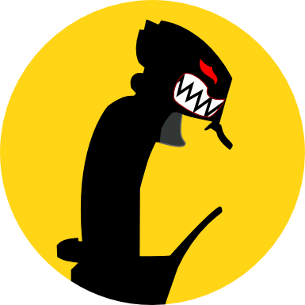
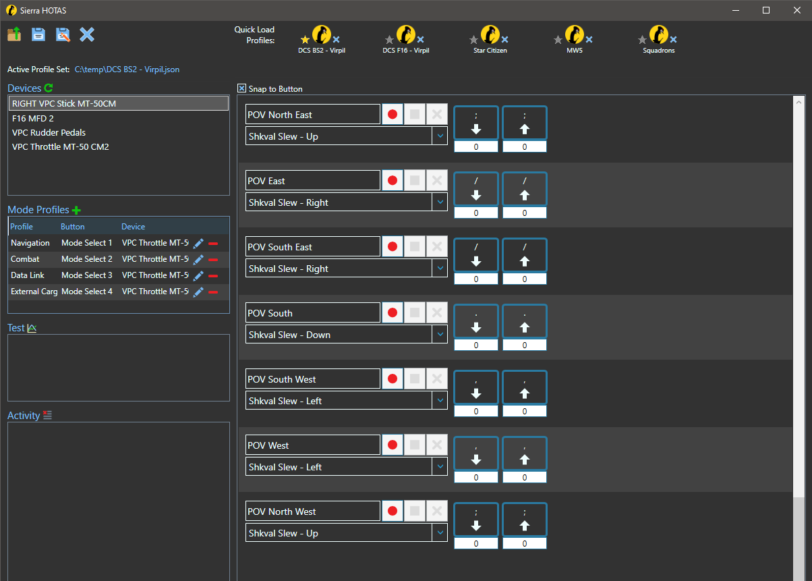

# SierraHOTAS

SierraHOTAS is a joystick to keyboard mapping windows desktop app with a focus on a complete yet easy to use interface. While my main use for it is with [DCS World](https://www.digitalcombatsimulator.com/en/) and [Star Citizen](https://robertsspaceindustries.com/), I've used it with other games like Star Wars Squadrons and Mechwarrior 5.

My first motivation behind creating this application was finding a lack of easy to use mappers that had all the features I wanted in one place. However, that does not mean this application is dense with features as some other mappers are. That is not my goal because there is much functionality I simply have no use for. Instead, it is focused on the few things that I personally want and seeing them implemented in a way I prefer.  Having said that, there *are* excellent mappers out there. In fact, had I known about RS Mapper before I started my project I might not have written that first line of code reading the joystick.

Here are just a few great joystick/controller to keyboard mappers to try:

- [RS Mapper](https://forums.eagle.ru/topic/175248-rs-mapper-release/)
- [JoyToKey](https://joytokey.net/en/)
- [Joystick Gremlin](https://whitemagic.github.io/JoystickGremlin/)
- [antimicro](https://github.com/AntiMicro/antimicro/releases)

This project is always a work in progress. It is also my first attempt at learning XAML and the MVVM pattern. If you have ideas for useful features or would like to contribute to the code base let me know!

## Functions/Features

Screens and popups are kept to a minium which means just about everything you need is shown and accessible on the main screen.

The first thing to note about button behavior is that there is no key-repeat. In games like DCS, the client is typically looking for a `key down` event in order to start an action and a `key up` event to stop that action. It doesn't typcially matter if that action is a fire and forget action or a continuous feed or repeated action. For a fire and forget action the `key up` event is irrelevant. Once the button on the joystick is pressed the action will occur without needing to wait for a `key up` event. For a continuous action the `key down` event starts the action which is maintained until a `key up` event is detected. Firing the cannon in an A-10 or KA-50 for example. This implementation also works for in-game cockpit buttons that require a "long press" of a button for one action and a "short press" of that same button for a different action. As in TMS Up in the A-10 again. This works without extra configuration in the mapper since the mapper is only sending `key up` events when the joystick button is released. The DCS game client is the one that is detecting how long a button has been held.

